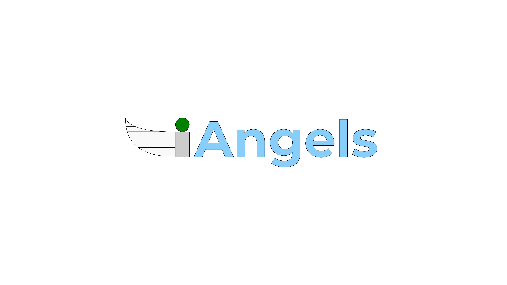

# Angels
 
site da nossa loja, programação
Um site responsivo feito com React e TailwindCSS.

## Pré-requisitos

site feito por João e Raul


Antes de começar, certifique-se de ter instalado:

- [Node.js](https://nodejs.org/) (versão recomendada LTS)
- npm (gerenciador de pacotes que vem junto com o Node.js)

Verifique com os comandos:
```bash
node -v
npm -v

Instalando as dependências
Depois de clonar o projeto, abra o terminal na raiz do projeto e execute:

bash
npm install


Rodando o projeto
Após instalar as dependências, use:

npm start run
